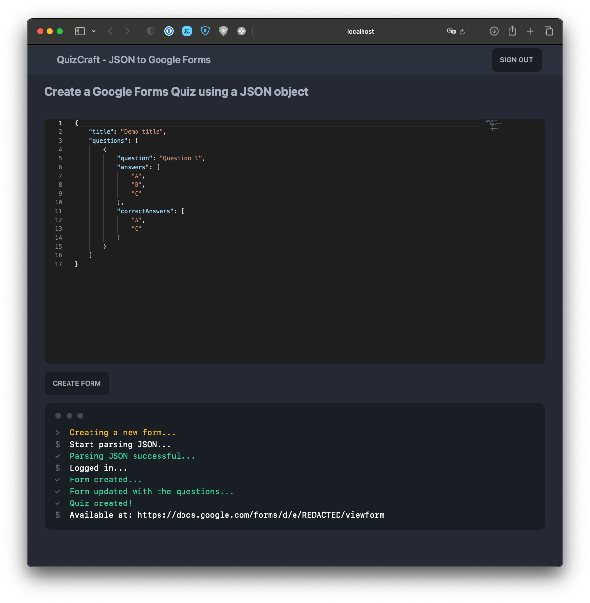
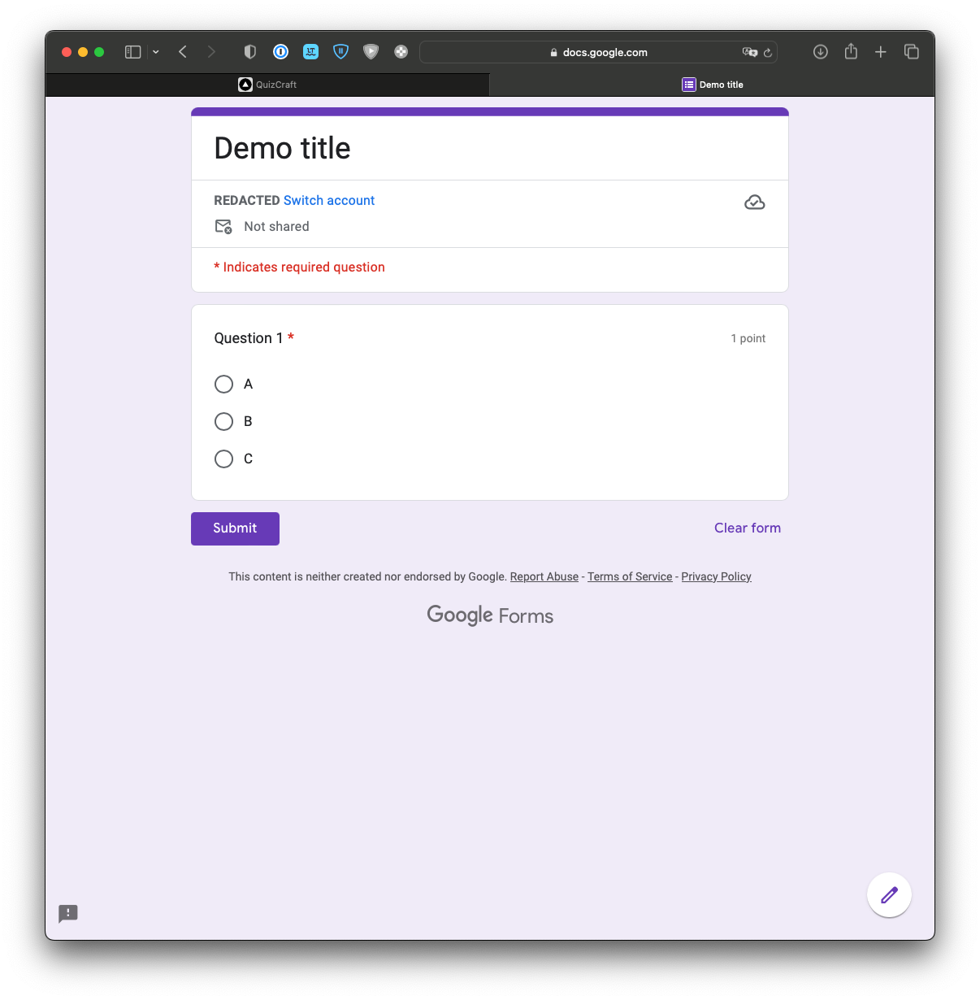

# QuizCraft

Effortlessly transform your JSON data into interactive Google Forms quizzes! With our user-friendly platform, generate
customized quizzes in no time by simply uploading your JSON file. Perfect for educators, trainers, and event organizers,
QuizCraft streamlines quiz creation and management, saving you time and effort. Get started now and unlock the full
potential of your data!

## Usage

There is a live version of the app hosted on [quizcraft.mael.app](https://quizcraft.mael.app). You can also run the app
locally by following the instructions below.

### Prerequisites

- [Node.js](https://nodejs.org/en/download/)

### Installation

1. Clone the repo
   ```sh
   git clone
    ```
2. Install NPM packages

 ```sh
   npm install
   ```

3. Set the environment variables

```dotenv
GOOGLE_CLIENT_ID=
GOOGLE_CLIENT_SECRET=
NEXTAUTH_URL=http://localhost:3000
NEXTAUTH_SECRET=
```

3. Run the app
   ```sh
    npm run dev
    ```
4. Open [http://localhost:3000](http://localhost:3000) to view it in the browser.

## Screenshots

<p float="left">
    
    
</p>
